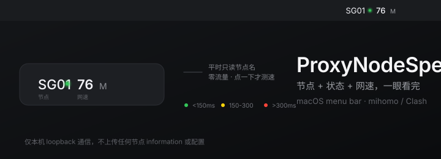

# ProxyNodeSpeed

<div align="center">
  
</div>

<p align="center">
  <b>菜单栏里看一眼：当前走的哪个节点，现在有多快。</b><br>
  <span style="color:#8b8b8b">See your current proxy node and its real speed, right in the menu bar.</span>
</p>

---

## 它显示什么

菜单栏常驻一行，格式极简：

```
SG01 ● 76M
```

三个部分：**节点名** + **状态点** + **实时网速**。

状态点的颜色只看延迟：

| 颜色 | 含义 |
|---|---|
| 🟢 绿 | 延迟 < 150 ms |
| 🟡 黄 | 延迟 150 ~ 300 ms |
| 🔴 红 | 延迟 > 300 ms，或测速失败 / 超时 |
| ⚪ 灰 | 正在测速，或暂时没有延迟数据 |

网速超过 10 秒没重测会变灰——节点网速波动快，过期数据不该装作是实时的。

## 为什么和别的不一样

**平时不测速。**

大多数网速工具的问题是它们一直在跑流量。这个 App 的做法是：

- 每 5 秒只**读一次当前节点名**（调用本地 mihomo API，不走网络流量）
- 只有你**点一下图标**才真正发起测速

所以日常挂机几乎不产生额外流量，也不会偷偷帮你下载几个 MB 的测速文件。

切换节点后，它会提示你结果已过期（数字变灰），你点一下刷新即可。

## 功能

- **自适应定位本机 API** — Clash Verge Rev 改了 socket 路径、端口或加了密钥都能自动发现：unix socket 优先，TCP 兜底，密钥自动匹配
- **自适应定位代理端口** — 从配置读取并实测验证，支持 `mixed-port` 及常见默认值
- **双重测速** — 延迟（毫秒）+ 带宽（Mbps），带宽用「预热 + 复用连接」两段法，避免 TCP 慢启动导致慢节点永远测不准
- **多测速源自动回退** — 主源挂了自动换下一个
- **零 Dock 图标** — `LSUIElement`，只在菜单栏存在
- **事件日志** — 每次测速结果写入 `~/Library/Logs/tizimenu.log`，出问题有据可查

## 前提

它依赖本机已经跑着一个 mihomo / Clash 内核客户端，并且开了 external controller。

默认适配：

- **Clash Verge Rev**（配置文件目录 `~/Library/Application Support/io.github.clash-verge-rev.clash-verge-rev`）
- 其他 mihomo 内核客户端只要放开了 control API，理论上也能被发现

它自己**不是代理工具**，不做任何代理、分流或规则管理。它只是个读数 + 测速的壳。

## 隐私

- 全部通信走本机 loopback / unix socket，不经过任何外部服务器
- 唯一的外部请求是测速时向公开测速源下载一小段数据（只在你点击时发生）
- 不上传任何你的节点列表、配置或账号信息
- mihomo 的 API secret 只在运行时从本机配置文件读取，源码中不含任何密钥

## 安装

### 从源码构建

```bash
git clone https://github.com/Lcone/ProxyNodeSpeed.git
cd ProxyNodeSpeed
./build.sh
open dist/ProxyNodeSpeed.app
```

需要 Xcode Command Line Tools：

```bash
xcode-select --install
```

## 使用

| 操作 | 结果 |
|---|---|
| 看菜单栏 | 当前节点名 + 延迟状态 + 网速 |
| 点一下图标 | 立即重新测速（延迟 + 带宽） |
| 测速中 | 数字显示 `…`，状态点变灰 |
| 超过 10 秒未重测 | 网速数字变灰，表示已过期 |

## 已知边界

- 慢节点（常态 < 3 Mbps）测速会限时 18 秒按实际下载量算平均值，可能比一次性跑完略低
- 如果客户端完全关掉或 API 失联，它会持续尝试重新发现，恢复后自动接上
- 只针对 macOS，依赖 AppKit

## 系统要求

- macOS 13 或更高版本
- 本机已运行 mihomo / Clash 内核客户端
- 从源码构建需要 Swift 5.9+

## 联系

请通过 [GitHub 作者主页](https://github.com/Lcone) 联系。

## 支持

如果每天看这一眼已经成了习惯，欢迎支持作者继续做下去。

<!-- SPONSOR -->
赞助方式即将上线。

## License

[MIT](LICENSE) © 2026 Lcone
